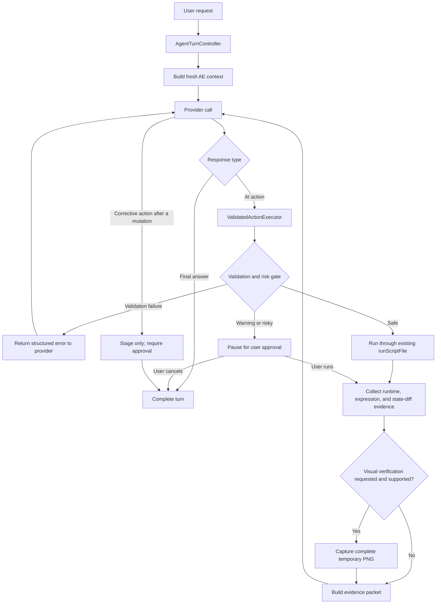

# Add a validated iterative After Effects agent loop

## Overview

Evolve AE AI Chat from a one-snapshot/one-action request-response flow into a bounded agent loop that can execute one validated action, inspect authoritative runtime evidence, optionally inspect a rendered frame, and then explicitly complete or stage a correction.

The implementation should borrow the strongest ideas from Flue—live application feedback, small observable steps, a consistent machine-readable contract, scripting-API retrieval, and local operational memory—without installing Flue, adding a second CEP panel, exposing raw `evalScript`, or allowing global agent skills to bypass AE AI Chat's validator and action protocol.

The panel remains the authority for:

- User intent and approval.
- Project-context trust boundaries.
- Script validation and risk classification.
- Action persistence and execution.
- Runtime, expression, and state-diff evidence.
- Preview capture and cleanup.
- Error logging and knowledge promotion.

## Executive recommendation

Implement the work through four product workstreams delivered in seven phases:

1. Isolate CLI providers and extract a reusable validated action executor.
2. Add an opt-in iterative verification controller using the existing `<ai-action>` protocol.
3. Add bounded visual verification for image-capable providers.
4. Add a message-matched scripting-DOM catalog and an optional dev-only JSON CLI over the existing panel driver.

Do not add a general-purpose shell-to-ExtendScript bridge to the packaged product. Do not install or auto-load the Flue skill in Claude or Codex sessions launched by the panel.

## Research synthesis

### Ideas to adopt

| Idea | Why it helps | Adaptation for this project |
|---|---|---|
| Inspect → act → verify loop | Complex AE work benefits from runtime feedback instead of one-shot confidence | Let the panel send post-run evidence and an optional preview back to the same provider session |
| Small observable steps | Limits blast radius in a stateful professional app | Permit one automatic mutation per user turn; stage any corrective mutation for approval |
| Structured shell/tool results | Makes failures and evidence easier for agents to consume | Define typed internal action/evidence objects and a versioned provider protocol |
| Runtime introspection over pretraining | AE APIs and versions are inconsistent | Keep the detailed snapshot authoritative and add bounded read-only probes only when a concrete gap is demonstrated |
| Broad scripting API index | Current corpus is deep for effects, properties, expressions, and recipes but not the entire scripting DOM | Generate message-matched `[DOCS]` records from a pinned docsforadobe source; never override verified effect data |
| Local reusable learnings | Version-specific quirks should compound | Continue promoting repeatable failures into gotchas, recipes, validator rules, and expression records rather than creating a separate mutable memory file |
| Visual preview verification | Object-model success does not prove visual success | Capture one temporary comp frame, wait for a complete PNG, and attach it only to image-capable providers |

### Ideas to reject

| Flue approach | Reason to reject here |
|---|---|
| Second persistent CEP bridge | Duplicates the existing panel and creates another install, lifecycle, and security surface |
| Raw arbitrary ExtendScript endpoint | Bypasses `validateScript`, `scanActionRisk`, expression rewriting, warning gates, and `runScriptFile` evidence |
| Global auto-triggering Adobe skill | Could activate inside panel-launched Claude/Codex sessions and mutate AE outside the `<ai-action>` lifecycle |
| Static injection of the full API index | Adds prompt cost and weakens retrieval precision |
| Treating docs extraction as verified knowledge | Documentation provenance is useful but is not equivalent to live AE verification |
| Unattended multi-mutation autonomy | Creates unclear undo semantics, duplicate artifacts, and difficult recovery after partial execution |

### Existing foundations to preserve

- `src/js/lib/context.ts:568-788`: byte-stable static context, dynamic snapshot context, pinned data, untrusted-data boundary, present-effect records, and last-action evidence.
- `src/js/lib/knowledge/index.ts:20-146`: static and message-matched knowledge composition.
- `src/js/lib/knowledge/validator.ts:32-460`: ES3, match-name, value-shape, enum, and range validation.
- `src/js/lib/security.ts:49-75`: side-effect risk classification.
- `src/js/lib/ai-action.ts:290-502`: action parsing, preparation, ephemeral persistence, and execution.
- `src/jsx/aeft/aeft.ts:1564-1692`: bounded before/after snapshots, expression evidence, and runtime errors.
- `src/shared/run-diff.ts:15-143`: deterministic state-diff generation.
- `scripts/ae-driver.mjs`: live dev-panel CDP primitives.
- `scripts/verify-recipes.mjs`, `scripts/verify-e2e.mjs`, and `.claude/skills/verify-loop/`: live AE verification and promotion workflow.

## Goals

- Let the model evaluate actual action evidence before making its final claim.
- Preserve current behavior when iterative verification is disabled.
- Keep all AE mutations inside the existing validation, risk, action, and evidence pipeline.
- Support Claude API, Claude CLI, and Codex with one product-level state machine.
- Prevent panel-launched CLI providers from using global skills, shell tools, MCP servers, or alternate Adobe bridges to mutate AE out of band.
- Allow one visual verification pass for providers that support image input.
- Expand scripting-DOM coverage without diluting the verified corpus.
- Feed new failures and gaps back into the existing recipe/gotcha/validator workflow.

## Non-goals

- Supporting Photoshop, Premiere, Illustrator, or other Flue adapters.
- Replacing CEP, `evalTS`, or the current provider implementations.
- Shipping a generic local HTTP `evalScript` service.
- Allowing autonomous saving, rendering, exporting, relinking, closing, or quitting.
- Automatically making multiple successful mutations in one user turn.
- Persisting unfinished agent turns across panel or AE restarts in the first release.
- Treating a non-empty state diff as proof of visual correctness.
- Importing Flue as a runtime or development dependency.

## Proposed architecture



### Core design decisions

| Decision | Selected approach | Rationale |
|---|---|---|
| Mutation primitive | Preserve `<ai-action>` | Maintains compatibility and reuses the strongest existing path |
| Completion signal | Add explicit `<ai-complete>...</ai-complete>` during iterative turns | Avoids heuristic loop completion while allowing legacy plain-text final responses outside verified mode |
| Automatic mutation cap | One per user turn | Keeps undo and partial-failure behavior understandable |
| Validation repairs | Up to two provider repairs before execution | These cannot mutate AE and are safe to automate |
| Corrective mutation | Save with `run=false` after the first mutation | User sees evidence and approves another state change explicitly |
| Loop cap | Three provider calls and ten minutes total | Bounds cost, latency, and stuck sessions |
| Preview cap | One frame per turn | Prevents render churn and temp-file accumulation |
| Provider protocol | Product-controlled textual protocol first | Works across API and CLI providers without provider-specific tool implementations |
| Native API tools | Defer until the common protocol is proven | Avoids divergent behavior between providers |
| Broad AE API data | Message-matched `[DOCS]` records | Adds coverage without bloating static context or weakening provenance |
| Developer shell access | Dev-only CLI over the existing panel/CDP driver | Gains Flue-like ergonomics without another production bridge |

## Typed contracts

Add panel-side contracts in `src/js/lib/agent-turn-types.ts`:

```ts
export type AgentTurnPhase =
  | "preparing"
  | "calling_provider"
  | "validating"
  | "awaiting_approval"
  | "running_action"
  | "capturing_preview"
  | "verifying"
  | "completed"
  | "cancelled"
  | "failed";

export interface AgentTurnLimits {
  maxProviderCalls: number;
  maxValidationRepairs: number;
  maxAutomaticMutations: number;
  maxPreviews: number;
  deadlineMs: number;
}

export interface ActionEvidence {
  attempt: number;
  ran: boolean;
  status: "blocked" | "failed" | "inconclusive" | "succeeded";
  validationErrors: ScriptValidationError[];
  validationWarnings: ScriptValidationWarning[];
  riskReasons: string[];
  runtimeError?: string;
  errorLine?: number | null;
  expressionErrors: ExpressionError[];
  expressionsSet: Array<{ name: string; layer?: string }>;
  stateDiff: string[];
  previewPath?: string;
}

export interface AgentTurnState {
  id: string;
  objective: string;
  phase: AgentTurnPhase;
  providerCalls: number;
  validationRepairs: number;
  automaticMutations: number;
  previews: number;
  startedAt: number;
  deadlineAt: number;
  evidence: ActionEvidence[];
  pendingCorrection?: string;
}
```

Keep display messages separate from the provider transcript. Intermediate action proposals and evidence must be available to the model without appearing as ordinary user-authored chat messages.

## Provider response protocol

Extend the response parser with a versioned iterative contract:

```xml
<ai-action run="true" verify="state">
// ExtendScript ES3
</ai-action>
```

```xml
<ai-action run="true" verify="visual">
// ExtendScript ES3
</ai-action>
```

```xml
<ai-complete>
The requested change is complete. Runtime evidence showed ...
</ai-complete>
```

Rules:

- Continue honoring existing `<ai-action run="true|false">` responses.
- Default `verify` to `state` in verified mode and `none` in legacy mode.
- Accept only the first action and first completion block.
- Reject a response containing both an executable action and completion.
- Treat malformed protocol as a provider error with one repair opportunity.
- After an action ran, any subsequent action is forced to `run=false` regardless of model output.
- A plain-text response after evidence is treated as a legacy completion but logged as a protocol fallback.
- Never expose raw action/evidence protocol tags in the rendered chat.

## Evidence packet

The panel should send a concise machine-readable result followed by freshly built context:

```markdown
## AE Action Evidence

- status: succeeded
- action_ran: true
- state_diff_count: 2
- expression_error_count: 0
- visual_preview_attached: true

<untrusted-ae-context>
Observed changes:
- Layers added: Title, Background
- Expressions changed on "Title" (0 -> 1)
</untrusted-ae-context>

Decide whether the user's objective is satisfied. If it is, return one
<ai-complete> block. If a correction is needed, return one staged
<ai-action run="false"> block and explain why user approval is required.
```

Important trust rule: status labels and counts are panel-authored, but layer names, effect names, expression text, error strings, and state-diff descriptions can contain project-derived data. Pass those strings through the existing untrusted-context defanging and boundary.

## User flows

### Flow 1: Answer-only request

1. User asks a question that does not require an AE mutation.
2. Controller builds context and calls the provider once.
3. Provider returns plain text or `<ai-complete>`.
4. Panel renders the answer and ends the turn.

Acceptance: no action file, preview, or extra provider call is created.

### Flow 2: Safe action with state verification

1. User asks for a change with verified mode enabled.
2. Provider returns one action.
3. Executor validates, risk-scans, saves, and runs through `runScriptFile`.
4. Panel gathers state diff and expression evidence.
5. Controller rebuilds live context and sends evidence to the same provider conversation.
6. Provider explicitly completes.
7. UI reports the action and evidence once, without duplicate assistant messages.

Acceptance: exactly one mutation and at most two provider calls.

### Flow 3: Validation failure before execution

1. Validator blocks the proposed script.
2. Nothing is written to AE.
3. Controller returns structured validation errors and relevant script lines.
4. Provider may repair twice within the overall call cap.
5. The first valid safe action runs normally.

Acceptance: validation repair never consumes the mutation budget and never creates an undo entry.

### Flow 4: Warning or risky action

1. Validator warning or `scanActionRisk` result blocks automatic execution.
2. Panel saves the action, opens the normal review affordance, and moves the turn to `awaiting_approval`.
3. User can inspect, run, ask for a safer alternative, or cancel.
4. If the user runs it, the same controller receives the evidence and resumes verification.
5. If the user cancels, no provider continuation occurs.

Acceptance: approval state survives normal UI interaction for the current panel session but is cleared on provider switch or panel unload.

### Flow 5: Runtime or expression failure

1. Executor records the error, error line, expression errors, and state diff.
2. If no mutation occurred, controller may request a staged repair.
3. If any tracked state changed, controller must not auto-run another script.
4. Panel explains that the action partially changed AE and offers explicit recovery choices: keep changes, undo manually and retry, inspect the staged fix, or stop.

Acceptance: a partial failure can never silently produce a second automatic mutation.

### Flow 6: Empty state diff

1. Script finishes with no runtime or expression error but the diff is empty.
2. Evidence status is `inconclusive`, not `succeeded`.
3. Provider must not claim that no change happened; untracked properties may have changed.
4. No automatic retry occurs because repeating the action could duplicate an untracked mutation.

Acceptance: existing “empty diff is inconclusive” semantics remain intact.

### Flow 7: Visual verification

1. Action requests `verify="visual"` and the active provider supports images.
2. Panel saves one frame at the playhead to `.session/previews/<turn-id>.png`.
3. CEP Node polls for a valid PNG `IEND` trailer before attachment.
4. Preview is attached to the evidence continuation.
5. Provider completes or stages a correction.
6. Preview is deleted after the turn or on panel unload.

Fallback: Claude CLI receives state evidence only and the final response says visual verification was unavailable.

### Flow 8: Cancellation or provider failure after mutation

1. User cancels or the second provider call fails after an action ran.
2. Controller stops all further calls and mutations.
3. Panel retains and displays the action evidence already obtained.
4. Final status distinguishes “action failed” from “action ran; verification was interrupted.”

Acceptance: cancellation never erases evidence or incorrectly reports that no action ran.

## Provider permutations

| Provider | Conversation continuation | Images | Required adaptation |
|---|---|---|---|
| Claude API | Rebuild message history explicitly | Yes | Maintain an internal provider transcript and attach preview blocks to the evidence message |
| Claude CLI | Resume by session ID | No | Run with customizations and tools disabled; send textual evidence only |
| Codex CLI | Resume by thread ID | Yes | Run in an isolated/read-only harness configuration; attach preview on the appropriate continuation |

## Implementation phases

### Phase 0: Baseline, protocol spike, and provider isolation

Estimated effort: medium. No user-facing behavior change.

#### Tasks

- Record baseline results for `pnpm test`, `pnpm typecheck`, `pnpm recipes:check`, `pnpm recipes:verify --all`, and `pnpm verify:e2e`.
- Add an ADR section to this plan or a small `docs/architecture/agent-loop.md` documenting the one-auto-mutation rule and provider boundary.
- Extract pure CLI-argument builders from:
  - `src/js/lib/providers/claude.ts`
  - `src/js/lib/providers/codex.ts`
- Add tests proving the panel providers cannot auto-load external skills or mutate the workspace out of band.
- Spike and verify these current CLI controls:
  - Claude: `--safe-mode`, `--disable-slash-commands`, `--tools ""`, and removal of `--dangerously-skip-permissions`.
  - Codex: temporary working directory, `--sandbox read-only`, `--ignore-user-config`, `--ignore-rules`, and `--skip-git-repo-check`.
- Preserve authentication, model selection, streaming, session resume, cancellation, and image attachment.
- Add launch diagnostics indicating whether provider isolation is active.
- If a CLI version cannot provide the required isolation, disable iterative mode for that provider and retain current one-shot behavior with a visible reason.

#### Files

- `src/js/lib/providers/claude.ts`
- `src/js/lib/providers/codex.ts`
- `src/js/lib/providers/provider.ts`
- `tests/provider-isolation.test.ts`
- `scripts/run-unit-tests.mjs`

#### Exit criteria

- Existing provider smoke tests still stream and resume.
- Claude/Codex launched by the panel cannot discover or invoke a globally installed Flue/Adobe skill during a fixture prompt.
- No provider requires write access to the project repository for normal panel operation.

### Phase 1: Extract the validated action executor

Estimated effort: medium-high. Structural refactor with behavior parity.

#### Tasks

- Move action orchestration out of `src/js/main/main.svelte` into `src/js/lib/action-executor.ts`.
- Expose two pure entry points:
  - `prepareAction(script, context)` → validation, warnings, risk, saved metadata.
  - `executePreparedAction(action)` → runtime result, expression evidence, state diff.
- Centralize result normalization currently duplicated between automatic and manual runs.
- Inject logging callbacks so the executor does not own UI state.
- Keep `saveAiAction`, `prepareRunnableScript`, and `runAiAction` as lower-level primitives or fold them behind the executor without changing session-file semantics.
- Ensure manual AI Action runs, auto-runs, auto-fix, and the test harness all use the same executor.
- Add `ActionEvidence` construction and status classification.
- Preserve warning behavior, risk confirmation, error annotation, recipe IDs, and original prompt logging.

#### Files

- New: `src/js/lib/action-executor.ts`
- New: `src/js/lib/agent-turn-types.ts`
- Update: `src/js/main/main.svelte`
- Update: `src/js/lib/ai-action.ts`
- Update: `src/js/lib/test-harness.ts`
- New: `tests/action-executor.test.ts`
- Update: `scripts/run-unit-tests.mjs`

#### Exit criteria

- Current one-shot flows are behaviorally unchanged.
- Automatic and manual runs produce identical normalized evidence for the same script.
- Existing E2E fixtures pass without enabling the agent loop.

### Phase 2: Add the iterative turn controller

Estimated effort: high. Core product milestone.

#### Tasks

- Add `src/js/lib/agent-protocol.ts` for parsing `<ai-action>` plus `<ai-complete>` and the optional `verify` attribute.
- Add `src/js/lib/agent-turn.ts` as the explicit state machine.
- Replace recursive auto-fix calls to `handleSend` with state-machine transitions.
- Add a separate provider transcript so intermediate model responses and evidence do not pollute rendered chat history.
- Rebuild `systemContext` before every continuation while keeping `staticContext` byte-stable.
- Add a protocol version to the static prelude; reset active provider sessions when that version changes.
- Add provider capability flags such as `supportsIterativeTurns` and `supportsImages`.
- Implement hard limits:
  - Three provider calls.
  - Two validation repairs.
  - One automatic mutation.
  - Ten-minute overall deadline.
  - No continuation after cancellation.
- Force all post-mutation corrections to stage-only.
- Add a collapsed UI trace showing attempt number, validation, execution, evidence, preview, and completion.
- Add an experimental “Verify actions with the model” setting, default off for the first release.
- Preserve legacy mode as the fallback and comparison baseline.

#### Files

- New: `src/js/lib/agent-protocol.ts`
- New: `src/js/lib/agent-turn.ts`
- New: `src/js/components/AgentTrace.svelte`
- Update: `src/js/main/main.svelte`
- Update: `src/js/lib/context.ts`
- Update: `src/js/lib/providers/provider.ts`
- Update: `src/js/lib/providers/claude-api.ts`
- Update: `src/js/lib/providers/claude.ts`
- Update: `src/js/lib/providers/codex.ts`
- New: `tests/agent-protocol.test.ts`
- New: `tests/agent-turn.test.ts`
- Update: `scripts/run-unit-tests.mjs`

#### Exit criteria

- Answer-only turns still call the provider once.
- Safe verified turns run exactly one action and explicitly complete after evidence.
- A second mutating action is always staged.
- All limit, cancellation, approval, and partial-failure transitions are deterministic unit tests.

### Phase 3: Add complete-frame visual verification

Estimated effort: medium.

#### Tasks

- Add a temporary preview API distinct from the user-facing screenshot action.
- Write previews under `.session/previews/`, not the project's persistent `screenshots/` directory.
- After `saveFrameToPng`, poll from CEP Node until the PNG ends with `IEND`, with a bounded timeout and file-size stability check.
- Add the preview only to providers whose capability says images are supported.
- Ensure the Claude API message builder can attach an image to an internal evidence continuation.
- Ensure Codex resume accepts an image on a continuation; if the installed CLI does not support that combination, fail closed to state-only evidence.
- Delete previews after completion, cancellation, timeout, provider switch, and panel unload.
- Never claim visual verification when capture or attachment failed.

#### Files

- New: `src/js/lib/preview-verification.ts`
- Update: `src/jsx/aeft/aeft.ts`
- Update: `src/js/lib/providers/claude-api.ts`
- Update: `src/js/lib/providers/codex.ts`
- Update: `src/js/main/main.svelte`
- New: `tests/preview-verification.test.ts`
- Update: `.gitignore` if needed for `.session/previews/`

#### Exit criteria

- No truncated preview is attached.
- One preview maximum is produced per turn.
- State-only providers complete honestly without a preview.
- Temp previews are absent after cleanup paths.

### Phase 4: Add a message-matched scripting-DOM catalog

Estimated effort: medium-high, parallelizable after Phase 1.

#### Source and provenance

- Source directly from a pinned commit of `docsforadobe/after-effects-scripting-guide`, not from the Flue package.
- Store the upstream commit, extraction date, generator version, and source path on every generated record or catalog manifest.
- Mark records `docs`, not `verified`.
- Exclude or subordinate effect match names already covered by the verified effect corpus.
- Promote individual gotchas or recipes only after the existing live AE verification workflow.

#### Tasks

- Add an explicit generator command such as:

  ```bash
  node scripts/generate-scripting-api.mjs --source <path-to-after-effects-scripting-guide>
  ```

- Do not attach this work to a bare `generate-knowledge.mjs` invocation; that command has an outdated sibling-repo default.
- Generate:
  - A compact class/member index for discovery.
  - Detailed records containing member type, signature, short description, version notes, and source.
- Add `src/js/lib/knowledge/scripting-api.ts` with message matching and strict character/record caps.
- Inject only records matched by user wording, present project state, or an explicitly requested operation.
- Establish precedence:
  1. Runtime/live AE evidence.
  2. `[VERIFIED]` local corpus.
  3. `[DOCS]` scripting records.
  4. Model pretraining.
- Add collision tests for effect names, expressions, properties, and scripting methods.
- Add `pnpm scripting-api:check` for deterministic generation, provenance, matcher smoke tests, and prompt-budget enforcement.
- Document the new corpus and regeneration command in `AGENTS.md`.

#### Files

- New: `scripts/generate-scripting-api.mjs`
- New: `src/js/lib/knowledge/scripting-api.ts`
- New: `src/js/lib/knowledge/data/scripting-api.ts`
- Update: `src/js/lib/knowledge/index.ts`
- New: `tests/scripting-api.test.ts`
- Update: `scripts/run-unit-tests.mjs`
- Update: `package.json`
- Update: `AGENTS.md`

#### Exit criteria

- Obscure scripting requests such as render-queue inspection or footage interpretation receive relevant documented signatures.
- Effect requests continue using the verified effect catalog without conflicts.
- Message-matched scripting context stays within its configured budget.
- Generated output is deterministic and committed.

### Phase 5: Add an optional dev-only JSON CLI

Estimated effort: small-medium. Developer workflow only.

#### Tasks

- Wrap `scripts/ae-driver.mjs` with `scripts/ae-agent-cli.mjs`.
- Support bounded commands:
  - `status`
  - `context`
  - `run --file <path>` through the dev panel's validated executor
  - `preview`
- Return JSON on stdout and structured errors on stderr.
- Extend the dev-only test harness with executor-backed methods; do not expose raw arbitrary execution in packaged builds.
- Add Just or `package.json` recipes for frequently used commands.
- If a project skill is added, make it explicitly manual (`disable-model-invocation: true`) and document that panel providers run with skills disabled.
- Do not install any global skill or create a second CEP extension.

#### Files

- New: `scripts/ae-agent-cli.mjs`
- Update: `scripts/ae-driver.mjs`
- Update: `src/js/lib/test-harness.ts`
- Update: `package.json`
- Optional: `.claude/skills/ae-live/SKILL.md`
- Update: `.claude/skills/verify-loop/README.md`

#### Exit criteria

- A developer can obtain context and validated evidence with one JSON command.
- The CLI cannot operate unless the dev panel is open and the dev-only harness is present.
- No packaged production surface exposes the CLI contract.

### Phase 6: Live AE evaluation and rollout

Estimated effort: medium, mostly verification.

#### Tasks

- Add E2E fixtures for:
  - Successful state verification.
  - Validation repair before execution.
  - Runtime failure with no observed mutation.
  - Partial failure with a non-empty diff.
  - Empty-diff inconclusive result.
  - Staged second mutation.
  - Approval pause and manual resume.
  - Cancellation during verification.
  - Provider failure after a successful mutation.
  - Visual preview success and timeout.
- Extend `window.__aeTest` to expose the agent trace and provider-call/mutation counts.
- Run the fixture matrix for Claude API, Claude CLI, and Codex where configured.
- Dogfood behind the experimental setting for at least one full verify-loop pass.
- Compare with the one-shot baseline:
  - Initial validation failure rate.
  - Runtime/expression failure rate.
  - Inconclusive action rate.
  - Provider calls and total latency.
  - Number of staged corrections.
  - User-visible duplicate/undo problems.
- Enable verified mode by default only after the quality gain justifies the extra latency and model cost.

#### Exit criteria

- `pnpm test`, `pnpm typecheck`, `pnpm build`, `pnpm recipes:check`, `pnpm recipes:verify --all`, and `pnpm verify:e2e` pass.
- No fixture produces more than one automatic mutation.
- All providers either support the bounded loop or clearly fall back to one-shot mode.
- Approval, cancellation, and cleanup work after both successful and failed provider calls.

## Acceptance criteria

### Functional

- [ ] Legacy one-shot mode remains available and behaviorally compatible.
- [ ] Verified mode sends runtime evidence back to the same provider conversation.
- [ ] Iterative turns end through explicit completion, approval pause, cancellation, failure, or a hard cap.
- [ ] Only one automatic AE mutation can occur per user turn.
- [ ] Post-mutation corrections are staged and visible before execution.
- [ ] Manual approval can resume the same turn with execution evidence.
- [ ] Visual verification attaches a complete frame only to image-capable providers.
- [ ] The scripting-DOM catalog is message-matched and provenance-labeled.

### Security and safety

- [ ] No raw local HTTP or shell-to-`evalScript` endpoint ships in production.
- [ ] CLI providers cannot auto-load global skills or external Adobe bridges.
- [ ] Project-derived evidence remains inside the untrusted-data boundary.
- [ ] Every mutation passes validation, warnings, and risk classification.
- [ ] File, network, shell, dynamic-code, menu-command, and quit risks still require human confirmation.
- [ ] Partial mutation prevents automatic retry.
- [ ] Preview paths are restricted to `.session/previews/` and cleaned up.
- [ ] Provider or protocol failures never cause fallback execution.

### Reliability

- [ ] Provider-call, validation-repair, mutation, preview, and total-time limits are enforced independently.
- [ ] Empty diffs remain explicitly inconclusive.
- [ ] Expression assignment success is not treated as expression evaluation success.
- [ ] Provider failure after mutation reports “verification interrupted,” not “action failed.”
- [ ] Provider switching or panel unload cancels and clears pending turns safely.
- [ ] Existing prompt-cache separation remains byte-stable for static context.

### Testing

- [ ] Parser tests cover malformed, duplicate, conflicting, escaped, and legacy protocol responses.
- [ ] State-machine tests cover every transition and cap.
- [ ] Executor tests cover safe, warning, risky, validation-error, runtime-error, expression-error, partial-diff, and no-op outcomes.
- [ ] Provider argument tests prove isolation flags and fallback behavior.
- [ ] Preview tests cover delayed/truncated PNGs, timeout, cleanup, and unsupported providers.
- [ ] Knowledge tests cover matching, provenance, precedence, collisions, and character budgets.
- [ ] Live AE E2E fixtures cover success, recovery, approval, cancellation, and visual verification.

### Documentation

- [ ] `README.md` explains verified mode, added latency/cost, approval pauses, and provider image differences.
- [ ] `AGENTS.md` documents the scripting-DOM corpus, provenance, regeneration command, and precedence.
- [ ] `.claude/skills/verify-loop/` includes the new fixture and trace workflow.
- [ ] Automated dev CLI behavior has a concise README or skill instructions.
- [ ] Flue is credited as architectural research, not added as a dependency.

## Success metrics

Measure locally from E2E reports and `.session/error-log.jsonl`; do not add telemetry by default.

| Metric | Target before default-on rollout |
|---|---|
| Existing E2E regression | 0 failures introduced |
| Automatic mutations per user turn | ≤ 1 in every fixture |
| Unbounded/stuck turns | 0; all stop at deadline or explicit terminal state |
| Expression errors claimed as success | 0 |
| Empty diffs claimed as verified success | 0 |
| Truncated previews attached | 0 |
| Temp preview leaks after terminal state | 0 |
| Out-of-band CLI AE mutations | 0 |
| Complex prompt success rate | Better than one-shot baseline on the same fixture set |
| Median extra provider calls in verified mode | ≤ 1 for a valid first action |

## Risks and mitigations

| Risk | Impact | Mitigation |
|---|---|---|
| Extra model call increases latency and cost | Users may prefer current speed | Experimental opt-in, visible status, hard call/deadline caps, measure before default-on |
| Multi-attempt actions create confusing undo history | User cannot easily reverse the full turn | One automatic mutation; stage corrections; report partial changes explicitly |
| Final saved action is only a corrective delta | Re-running it may not recreate the full result | Disable or relabel one-click rerun for multi-step approved turns; consider later consolidated replay generation |
| CLI provider discovers Flue/global skills | Mutation bypasses panel controls | Disable skills/tools/customizations and test launch arguments |
| Provider-specific continuation behavior diverges | Inconsistent product behavior | Product-level state machine and conformance fixtures; native tools deferred |
| Preview returns before PNG completion | Model judges corrupted image | Poll for `IEND`, size stability, and timeout before attachment |
| API index conflicts with verified effect data | Reintroduces guessed match names | Explicit provenance and precedence; exclude duplicate effect records |
| Fresh context contains prompt-injection strings | Model follows project data | Reuse defanging and untrusted boundary for every continuation |
| Failed action partially mutates AE | Retry duplicates or compounds damage | Detect non-empty diff, halt auto-retry, require recovery choice |
| Provider session contains old protocol | Model does not follow completion contract | Protocol versioning and session reset on upgrade |
| `main.svelte` state remains too coupled | Loop becomes difficult to test | Extract executor and controller before adding UI behavior |

## Alternatives considered

### Install Flue globally

Rejected. It duplicates transport and could auto-trigger inside the exact CLI sessions the panel launches. Its raw execution path would not inherit this project's safety and verification pipeline.

### Embed Flue's tokenized HTTP bridge in the existing panel

Deferred. A tokenized loopback endpoint is better than an unauthenticated one, but the packaged product does not need a new local server to implement an application-controlled provider loop. Revisit only if production shell access becomes a product requirement and complete a threat model first.

### Give Claude/Codex unrestricted access to `scripts/ae-driver.mjs`

Rejected for panel use. The dev driver is excellent for verification, but unrestricted CLI access lets the provider bypass user-facing approvals and action logging.

### Use native Anthropic tools and Codex/Claude agent tools immediately

Deferred. It would create three provider-specific implementations before the desired product behavior is proven. Start with one versioned protocol and state machine, then optimize providers individually.

### Inject the full scripting API index statically

Rejected. It is less precise, increases prompt cost, and can invalidate cache advantages. Use a compact index plus message-matched detail records.

### Allow two automatic corrective mutations

Rejected for the first release. AE is stateful, diffs are bounded, and a successful second mutation makes undo and replay semantics ambiguous. Reconsider only after live evidence demonstrates safe convergence.

## Dependencies and prerequisites

- AE dev panel open with CEP debug mode for live verification.
- Existing `chrome-remote-interface` dev dependency.
- Configured providers for the provider matrix.
- A pinned local checkout or source snapshot of the docsforadobe scripting guide for generation.
- No Flue installation required.
- No database or persistent-data migration.

## Commit and review strategy

Keep each milestone independently reviewable:

1. `security: isolate panel CLI providers`
2. `refactor: extract validated action executor`
3. `feat: add bounded AE verification loop`
4. `feat: add visual action verification`
5. `feat: add scripting DOM knowledge retrieval`
6. `chore: add dev AE JSON driver and verification fixtures`
7. `docs: document verified agent workflow`

Run the full proportional verification suite before each push. Do not mix generated scripting-data changes with the executor/state-machine refactor.

## Future considerations

- Native tool calling for Claude API after the common state machine is stable.
- A read-only `inspect_property_tree` primitive when telemetry shows the current snapshot is insufficient.
- Consolidated replay scripts for user-approved multi-step turns.
- A production tokenized shell bridge only if direct terminal control becomes a supported product surface.
- Cross-application workflows only as a separate product decision.
- User-level preferences for verification mode, preview policy, call budget, and model tier.

## References

### Internal

- `src/js/lib/context.ts`
- `src/js/lib/knowledge/index.ts`
- `src/js/lib/knowledge/validator.ts`
- `src/js/lib/security.ts`
- `src/js/lib/ai-action.ts`
- `src/js/main/main.svelte`
- `src/jsx/aeft/aeft.ts`
- `src/shared/run-diff.ts`
- `scripts/ae-driver.mjs`
- `scripts/verify-recipes.mjs`
- `scripts/verify-e2e.mjs`
- `.claude/skills/verify-loop/`

### External research

- Flue Adobe skill: https://github.com/SFKislev/Flue/blob/main/skills/adobe/SKILL.md
- Flue After Effects adapter: https://github.com/SFKislev/Flue/blob/main/adapters/after_effects_adapter/APP.md
- Flue bridge contract: https://github.com/SFKislev/Flue/blob/main/shared/bridge-contract.md
- Flue coexistence guidance: https://github.com/SFKislev/Flue/blob/main/shared/coexistence.md
- Flue AE API-index provenance: https://github.com/SFKislev/Flue/blob/main/adapters/after_effects_adapter/docs/sources.md
- docsforadobe After Effects scripting guide: https://github.com/docsforadobe/after-effects-scripting-guide
- Flue PyPI maturity metadata: https://pypi.org/project/flue/
