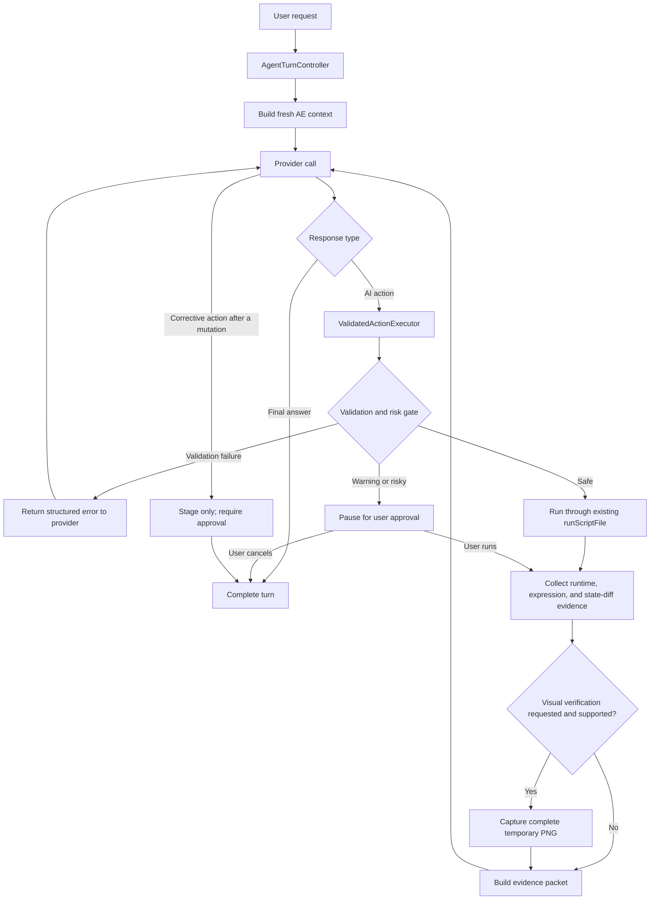

# Add a validated iterative After Effects agent loop

## Overview

Evolve AE AI Chat from a one-snapshot/one-action request-response flow into a bounded agent loop that can execute one validated action, inspect authoritative runtime evidence, optionally inspect a rendered frame, and then explicitly complete or stage a correction.

The implementation should borrow the strongest ideas from Flue—live application feedback, small observable steps, a consistent machine-readable contract, scripting-API retrieval, and local operational memory—without installing Flue, adding a second CEP panel, exposing raw `evalScript`, or allowing global agent skills to bypass AE AI Chat's validator and action protocol.

The panel remains the authority for:

- User intent and approval.
- Project-context trust boundaries.
- Script validation and risk classification.
- Action persistence and execution.
- Runtime, expression, and state-diff evidence.
- Preview capture and cleanup.
- Error logging and knowledge promotion.

## Executive recommendation

Implement the work through four product workstreams delivered in seven phases:

1. Isolate CLI providers and extract a reusable validated action executor.
2. Add an opt-in iterative verification controller using the existing `<ai-action>` protocol.
3. Add bounded visual verification for image-capable providers.
4. Add a message-matched scripting-DOM catalog and an optional dev-only JSON CLI over the existing panel driver.

Do not add a general-purpose shell-to-ExtendScript bridge to the packaged product. Do not install or auto-load the Flue skill in Claude or Codex sessions launched by the panel.

## Research synthesis

### Ideas to adopt

| Idea | Why it helps | Adaptation for this project |
|---|---|---|
| Inspect → act → verify loop | Complex AE work benefits from runtime feedback instead of one-shot confidence | Let the panel send post-run evidence and an optional preview back to the same provider session |
| Small observable steps | Limits blast radius in a stateful professional app | In verified mode, permit one controller-managed execution attempt per user turn; stage every later action for approval |
| Structured shell/tool results | Makes failures and evidence easier for agents to consume | Define typed internal action/evidence objects and a versioned provider protocol |
| Runtime introspection over pretraining | AE APIs and versions are inconsistent | Keep the detailed snapshot authoritative and add bounded read-only probes only when a concrete gap is demonstrated |
| Broad scripting API index | Current corpus is deep for effects, properties, expressions, and recipes but not the entire scripting DOM | Generate message-matched `[DOCS]` records from a pinned docsforadobe source; never override verified effect data |
| Local reusable learnings | Version-specific quirks should compound | Continue promoting repeatable failures into gotchas, recipes, validator rules, and expression records rather than creating a separate mutable memory file |
| Visual preview verification | Object-model success does not prove visual success | Capture one temporary comp frame, wait for a complete PNG, and attach it only to image-capable providers |

### Ideas to reject

| Flue approach | Reason to reject here |
|---|---|
| Second persistent CEP bridge | Duplicates the existing panel and creates another install, lifecycle, and security surface |
| Raw arbitrary ExtendScript endpoint | Bypasses `validateScript`, `scanActionRisk`, expression rewriting, warning gates, and `runScriptFile` evidence |
| Global auto-triggering Adobe skill | Could activate inside panel-launched Claude/Codex sessions and mutate AE outside the `<ai-action>` lifecycle |
| Static injection of the full API index | Adds prompt cost and weakens retrieval precision |
| Treating docs extraction as verified knowledge | Documentation provenance is useful but is not equivalent to live AE verification |
| Unattended multi-mutation autonomy | Creates unclear undo semantics, duplicate artifacts, and difficult recovery after partial execution |

### Existing foundations to preserve

- `buildContext` and `getStaticContext` in `src/js/lib/context.ts`: byte-stable static context, dynamic snapshot context, pinned data, untrusted-data boundary, present-effect records, and last-action evidence.
- `getStaticKnowledgeContext` and `getMessageKnowledgeContext` in `src/js/lib/knowledge/index.ts`: static and message-matched knowledge composition.
- `validateScript` in `src/js/lib/knowledge/validator.ts`: ES3, match-name, value-shape, enum, and range validation.
- `scanActionRisk` in `src/js/lib/security.ts`: side-effect risk classification.
- `parseAiAction`, `saveAiAction`, and `runAiAction` in `src/js/lib/ai-action.ts`: action parsing, preparation, ephemeral persistence, and execution.
- `runScriptFile` and `saveFrameToPng` in `src/jsx/aeft/aeft.ts`: bounded before/after snapshots, expression evidence, runtime errors, and frame capture.
- `diffRunSnapshots` in `src/shared/run-diff.ts`: deterministic state-diff generation.
- `scripts/ae-driver.mjs`: live dev-panel CDP primitives.
- `scripts/verify-recipes.mjs`, `scripts/verify-e2e.mjs`, and `.claude/skills/verify-loop/`: live AE verification and promotion workflow.

## Goals

- Let the model evaluate actual action evidence before making its final claim.
- Preserve current behavior when iterative verification is disabled.
- Keep all AE mutations inside the existing validation, risk, action, and evidence pipeline.
- Support Claude API, Claude CLI, and Codex with one product-level state machine.
- Prevent panel-launched CLI providers from using global skills, shell tools, MCP servers, or alternate Adobe bridges to mutate AE out of band.
- Allow one visual verification pass for providers that support image input.
- Expand scripting-DOM coverage without diluting the verified corpus.
- Feed new failures and gaps back into the existing recipe/gotcha/validator workflow.

## Non-goals

- Supporting Photoshop, Premiere, Illustrator, or other Flue adapters.
- Replacing CEP, `evalTS`, or the current provider implementations.
- Shipping a generic local HTTP `evalScript` service.
- Allowing autonomous saving, rendering, exporting, relinking, closing, or quitting.
- In verified mode, automatically making more than one execution attempt in one user turn, whether or not the first attempt produced an observed diff.
- Persisting unfinished agent turns across panel or AE restarts in the first release.
- Treating a non-empty state diff as proof of visual correctness.
- Importing Flue as a runtime or development dependency.

## Proposed architecture



### Core design decisions

| Decision | Selected approach | Rationale |
|---|---|---|
| Mutation primitive | Preserve `<ai-action>` | Maintains compatibility and reuses the strongest existing path |
| Completion signal | Add explicit `<ai-complete>...</ai-complete>` during iterative turns | Avoids heuristic loop completion while allowing legacy plain-text final responses outside verified mode |
| Verified-turn execution cap | One controller-managed execution attempt per verified turn, consumed immediately before execution | Empty diffs and thrown errors cannot accidentally authorize a second mutation |
| Pre-execution repairs | Two total, shared by validation failures and malformed protocol | These cannot mutate AE and are safe to automate; one evidence call remains reserved |
| Corrective mutation | Save with `run=false` after the first mutation | User sees evidence and approves another state change explicitly |
| Loop cap | Four provider calls: initial + two repair slots + one reserved evidence continuation | The evidence continuation cannot be displaced by repair attempts |
| Active-time cap | Ten minutes excluding `awaiting_approval` | Bounds model/processing time without expiring while the user reviews a script |
| Preview cap | One frame per turn | Prevents render churn and temp-file accumulation |
| Provider protocol | Product-controlled textual protocol first | Works across API and CLI providers without provider-specific tool implementations |
| Native API tools | Defer until the common protocol is proven | Avoids divergent behavior between providers |
| Broad AE API data | Message-matched `[DOCS]` records | Adds coverage without bloating static context or weakening provenance |
| Developer shell access | Dev-only CLI over the existing panel/CDP driver | Gains Flue-like ergonomics without another production bridge |

## Typed contracts

Add serializable evidence DTOs to `src/shared/agent-evidence.ts`. Move `ExpressionError` there from `src/js/lib/auto-fix.ts`, and import it from the shared module in `auto-fix.ts`, `error-log.ts`, `main.svelte`, and the executor. Export `RunStateDiff = ReturnType<typeof diffRunSnapshots>` from `src/shared/run-diff.ts`; `ActionEvidence.stateDiff` must use that type instead of inventing another representation. Keep validator-native `ScriptValidationError` and `ScriptValidationWarning` inside the executor, mapping them to shared `EvidenceValidationIssue` DTOs at the boundary so shared code does not import panel knowledge modules.

Add panel-side turn contracts in `src/js/lib/agent-turn-types.ts`:

```ts
export type AgentTurnPhase =
  | "preparing"
  | "calling_provider"
  | "validating"
  | "awaiting_approval"
  | "running_action"
  | "capturing_preview"
  | "verifying"
  | "verification_interrupted"
  | "completed"
  | "cancelled"
  | "failed";

export interface AgentTurnLimits {
  maxProviderCalls: number;
  maxPreExecutionRepairs: number;
  maxExecutionAttempts: number;
  maxPreviews: number;
  activeDeadlineMs: number;
}

export interface ActionEvidence {
  attempt: number;
  ran: boolean;
  status: "blocked" | "failed" | "inconclusive" | "succeeded";
  validationErrors: EvidenceValidationIssue[];
  validationWarnings: EvidenceValidationIssue[];
  riskReasons: string[];
  runtimeError?: string;
  errorLine?: number | null;
  expressionErrors: ExpressionError[];
  expressionsSet: Array<{ name: string; layer?: string }>;
  stateDiff: RunStateDiff;
  previewPath?: string;
  previewUnavailableReason?:
    | "no_active_comp"
    | "unsupported_provider"
    | "capture_timeout"
    | "capture_failed"
    | "resize_failed"
    | "oversized";
}

export interface AgentTurnState {
  id: string;
  objective: string;
  phase: AgentTurnPhase;
  providerCalls: number;
  preExecutionRepairs: number;
  executionAttempts: number;
  previews: number;
  startedAt: number;
  activeDeadlineAt: number;
  remainingActiveMs: number;
  pausedAt?: number;
  evidence: ActionEvidence[];
  pendingCorrection?: string;
}
```

Use these exact defaults in verified mode:

```ts
const VERIFIED_TURN_LIMITS: AgentTurnLimits = {
  maxProviderCalls: 4,
  maxPreExecutionRepairs: 2,
  maxExecutionAttempts: 1,
  maxPreviews: 1,
  activeDeadlineMs: 600_000,
};
```

Call accounting is deterministic:

- Call 1 is the initial response.
- Calls 2 and 3 are the only possible pre-execution repair calls. Validation failures and malformed protocol share `preExecutionRepairs`; each repair request increments both counters before sending.
- One slot is always reserved for the first execution attempt's evidence continuation. Evidence is the next actual call—call 2, 3, or 4 depending on repair count—and repair logic must stop when `providerCalls === maxProviderCalls - 1`.
- If two repairs do not produce a valid action, fail before mutation. If the evidence continuation fails or returns malformed protocol, terminate as `verification_interrupted` while retaining the execution evidence; do not make another call.
- Unused repair slots never become extra post-execution calls.
- A transport/provider error or active-time timeout consumes the call already started but never consumes `preExecutionRepairs` and is not retried automatically. Before execution it terminates as `failed`; after execution it terminates as `verification_interrupted`.

The ten-minute deadline measures active controller time. On entry to `awaiting_approval`, compute `remainingActiveMs = max(0, activeDeadlineAt - now)`, set `pausedAt`, and stop the deadline timer. Manual run resumes with `activeDeadlineAt = now + remainingActiveMs`; it does not receive a fresh ten minutes. Waiting for approval has no wall-clock timeout during the current panel session, but provider switch, verification-setting change, panel unload, or explicit cancellation clears it.

Mutation accounting is also deterministic. `AgentTurnController.claimExecutionSlot(turnId)` atomically checks and increments `executionAttempts`; both the controller's safe auto-run path and `main.svelte`'s matching manual-approval path must call it immediately before `executePreparedAction`. Every controller-managed execution attempt consumes the single budget even if it throws, reports expression errors, or produces an empty diff. Every later action in that verified turn is persisted with `run=false` and ends the loop in a staged-correction state. If the active-time budget is already zero before entering `awaiting_approval`, fail instead of pausing; otherwise pause and preserve the exact positive remainder.

## Provider response protocol

Extend the response parser with a versioned iterative contract:

```xml
<ai-action run="true" verify="state">
// ExtendScript ES3
</ai-action>
```

```xml
<ai-action run="true" verify="visual">
// ExtendScript ES3
</ai-action>
```

```xml
<ai-complete>
The requested change is complete. Runtime evidence showed ...
</ai-complete>
```

Rules:

- Legacy mode continues honoring the first `<ai-action run="true|false">` exactly as today; the stricter rules below apply only in verified mode.
- Default `verify` to `state` in verified mode and `none` in legacy mode.
- Before scanning, mask triple-backtick and triple-tilde fenced code regions. Protocol-looking tags inside fences are inert quoted examples, not commands.
- In verified mode, a tag-bearing response may contain exactly one top-level `<ai-action>` or exactly one top-level `<ai-complete>`. Duplicate blocks, nested blocks, unclosed tags, unsupported `verify` values, and any response containing both action and completion are malformed.
- Before execution, malformed protocol consumes one of the same two `preExecutionRepairs` used by validation failures. There is no separate protocol-repair budget.
- After execution, a malformed evidence response terminates as `verification_interrupted`; the call cap forbids another repair call.
- After any execution attempt, any subsequent action is forced to `run=false` regardless of model output or observed diff.
- A tag-free plain-text response on call 1 completes an answer-only turn. A tag-free plain-text response after evidence is treated as a legacy completion but logged as a protocol fallback.
- During a pre-execution repair phase, tag-free or empty output is malformed and can trigger only the next remaining shared repair slot. An empty response in any other phase is malformed.
- Never expose raw action/evidence protocol tags in the rendered chat.

### Model-facing protocol text

Author the verified-mode instructions in `STATIC_PRELUDE`/`getStaticContext` in `src/js/lib/context.ts`; this is a required Phase 2 deliverable, not provider-specific prompt text. Set `AGENT_PROTOCOL_VERSION = "verified-v1"` and `LEGACY_PROTOCOL_VERSION = "legacy-v1"`. Cache static context by protocol version, not in the current single global cache slot. Use two byte-stable prelude variants selected by verification mode:

- Legacy prelude: preserve the current action protocol byte-for-byte except for an explicit protocol-version identifier.
- Verified prelude: define `<ai-action>`, `run`, `verify="state|visual"`, `<ai-complete>`, evidence status meanings, the one-execution-attempt rule, and the requirement that every post-evidence correction use `run="false"`.
- Tell the model that it has no authorized shell, MCP, skill, or alternate Adobe bridge and must express every AE mutation through one top-level `<ai-action>`.
- Tell the model that `succeeded` means tracked state changed without a reported runtime/expression error, `inconclusive` means the bounded diff was empty, and `failed` can still include partial changes.
- Require an answer-only turn to return plain text or one `<ai-complete>`, and an action turn to return one action without claiming completion in the same response.

Use this normative verified-mode stanza verbatim apart from normal line wrapping:

```text
## Iterative AI Action Protocol (verified-v1)

For an answer that does not modify After Effects, return plain text or exactly one
<ai-complete>...</ai-complete> block.

For an After Effects mutation, return exactly one top-level block:
<ai-action run="true" verify="state">ES3 ExtendScript</ai-action>
or request a preview with verify="visual". Use run="false" when the action must be
reviewed before execution. Never return an action and <ai-complete> together.

The panel is the only authority allowed to execute After Effects mutations. You have
no authorized shell, MCP server, skill, or alternate Adobe bridge. Every mutation must
use the single <ai-action> block and will pass panel validation and risk checks.

The panel permits one execution attempt in this verified turn. An attempt consumes the
budget even when it errors or the bounded state diff is empty. After any action evidence,
either return exactly one <ai-complete> block or exactly one corrective
<ai-action run="false"> block for user review. Never request an automatic second run.

Evidence status "succeeded" means tracked state changed with no reported runtime or
expression error. "inconclusive" means the bounded diff was empty and is not proof that
nothing changed. "failed" may still include partial changes. Base completion claims only
on the supplied evidence and fresh AE context.
```

The legacy variant adds only `## AI Action Protocol (legacy-v1)` ahead of the existing action-protocol text; all remaining legacy instructions stay byte-for-byte unchanged.

Build the session fingerprint from `provider id + model + verification mode + selected protocol version`. Changing the verification toggle, model, provider, or protocol version cancels the active turn, clears the controller transcript, and sets the provider `sessionId` to `undefined`. This is mandatory because resumed CLI sessions receive static context only on their first call.

## Evidence packet

The panel should send a concise machine-readable result followed by freshly built context:

```markdown
## AE Action Evidence

- status: succeeded
- action_ran: true
- state_diff_count: 2
- expression_error_count: 0
- visual_preview_attached: true

<untrusted-ae-context>
Observed changes:
- Layers added: Title, Background
- Expressions changed on "Title" (0 -> 1)
</untrusted-ae-context>

Decide whether the user's objective is satisfied. If it is, return one
<ai-complete> block. If a correction is needed, return one staged
<ai-action run="false"> block and explain why user approval is required.
```

Important trust rule: status labels and counts are panel-authored, but layer names, effect names, expression text, error strings, and state-diff descriptions can contain project-derived data. Pass those strings through the existing untrusted-context defanging and boundary.

### Evidence-message mechanics

`AgentTurnController` owns a `ProviderMessage[]` transcript independent of rendered `ChatMessage[]`. Change the provider contract from `(prompt, options, history: ChatMessage[])` to one `ProviderTurnInput` containing `message`, `priorTranscript`, and `options`; the UI continues to own display messages. `message` is the current user-role input and `priorTranscript` contains only previously accepted user/assistant pairs. After a successful call, append that current message and the provider response to the controller transcript. Evidence is the next panel-authored user-role `message`, never a `system` or rendered user message.

Add these contracts to `src/js/lib/providers/provider.ts`:

```ts
export interface ProviderMessage {
  role: "user" | "assistant";
  text: string;
  imagePath?: string;
  origin: "user" | "provider" | "panel_control" | "panel_evidence";
}

export interface ProviderTurnInput {
  message: ProviderMessage & { role: "user" };
  priorTranscript: ProviderMessage[];
  options: SendMessageOptions;
}
```

Use `origin: "user"` for the initial prompt, `"panel_control"` for validation/protocol repair requests, `"panel_evidence"` for post-run evidence, and `"provider"` for assistant responses.

For every continuation, call `buildContext` again and pass its new `systemContext` separately from the transcript:

- Claude API rebuilds the API `system` field from byte-stable `staticContext` plus current `systemContext`; that system field precedes the conversation semantically. It then sends `priorTranscript` followed by `message`. The evidence text and optional preview image are content blocks in that same current user message.
- Claude CLI and Codex keep their provider-native session IDs. The controller records the transcript for traceability but the provider sends only the current message on resume. Its prompt is `systemContext + "\n\n" + message.text`; it omits `staticContext` because the native session already contains it.
- Codex visual continuation uses `codex exec resume -i <preview-path> ...`. Provider capability startup checks the installed `codex exec resume --help` output once and records the detected version/capability in diagnostics.
- A provider switch or session-fingerprint change discards both native session ID and controller transcript; they must never drift independently.

## User flows

### Flow 1: Answer-only request

1. User asks a question that does not require an AE mutation.
2. Controller builds context and calls the provider once.
3. Provider returns plain text or `<ai-complete>`.
4. Panel renders the answer and ends the turn.

Acceptance: no action file, preview, or extra provider call is created.

### Flow 2: Safe action with state verification

1. User asks for a change with verified mode enabled.
2. Provider returns one action.
3. Executor validates, risk-scans, saves, and runs through `runScriptFile`.
4. Panel gathers state diff and expression evidence.
5. Controller rebuilds live context and sends evidence to the same provider conversation.
6. Provider explicitly completes.
7. UI reports the action and evidence once, without duplicate assistant messages.

Acceptance: exactly one execution attempt and at most two provider calls when the first action is valid.

### Flow 3: Validation failure before execution

1. Validator blocks the proposed script.
2. Nothing is written to AE.
3. Controller returns structured validation errors and relevant script lines.
4. After each blocked response, controller requests a repair while `preExecutionRepairs < 2`; calls 2 and 3 are the only repair calls, and protocol and validation failures consume the same counter.
5. The first valid safe action runs normally.

Acceptance: pre-execution repair never consumes the execution budget or creates an undo entry, and call 4 remains available for evidence.

### Flow 4: Warning or risky action

1. Validator warning or `scanActionRisk` result blocks automatic execution.
2. Panel saves the action, opens the normal review affordance, and moves the turn to `awaiting_approval`.
3. User can inspect, run, or cancel. Asking for a different action cancels this pending turn and starts a new user turn.
4. If the user runs it, `main.svelte` calls the same executor, then passes normalized evidence to `activeAgentTurn.resumeAfterApprovedAction(evidence)`.
5. If the user cancels, no provider continuation occurs.

Acceptance: approval state and its remaining active-time budget survive normal UI interaction for the current panel session; the active deadline is paused until run/cancel and the state is cleared on provider/model/toggle change or panel unload.

### Flow 5: Runtime or expression failure

1. Executor records the error, error line, expression errors, and state diff.
2. The execution attempt has already consumed the sole verified-turn execution budget, regardless of whether the diff is empty.
3. Controller sends that evidence through the single reserved continuation and accepts only completion or a staged `run=false` correction; it never auto-runs another script.
4. If tracked state changed, the panel explains that the action partially changed AE and offers explicit recovery choices: keep changes, undo manually and start a new turn, inspect the staged fix, or stop.

Acceptance: neither a partial failure nor an observed no-op can produce a second controller-managed execution attempt.

### Flow 6: Empty state diff

1. Script finishes with no runtime or expression error but the diff is empty.
2. Evidence status is `inconclusive`, not `succeeded`.
3. Provider must not claim that no change happened; untracked properties may have changed.
4. No automatic retry occurs because repeating the action could duplicate an untracked mutation.

Acceptance: existing “empty diff is inconclusive” semantics remain intact.

### Flow 7: Visual verification

1. Action requests `verify="visual"` and the active provider supports images.
2. If no active comp exists, record `previewUnavailableReason: "no_active_comp"` and continue with state evidence.
3. Otherwise the panel saves a raw frame at the playhead, waits for a valid PNG `IEND`, then uses the macOS system `sips` command with fixed panel-controlled arguments to downscale the longest edge to at most 2,048 pixels.
4. Validate the downscaled PNG again and attach it only if its final file size is at most 8 MiB; otherwise record `previewUnavailableReason: "oversized"` and continue state-only.
5. Preview is attached to the evidence continuation.
6. Provider completes or stages a correction.
7. Raw and downscaled previews are deleted after the turn or on panel unload.

Fallback: Claude CLI, missing active comp, capture/resize failure, timeout, and an oversized final PNG all use state evidence and include the precise panel-authored unavailability reason. Preview failure never fails the action turn.

### Flow 8: Cancellation or provider failure after mutation

1. User cancels or the evidence continuation fails after an action ran.
2. Controller stops all further calls and mutations.
3. Panel retains and displays the action evidence already obtained.
4. Final status distinguishes “action failed” from “action ran; verification was interrupted.”

Acceptance: cancellation never erases evidence or incorrectly reports that no action ran.

## Provider permutations

| Provider | Conversation continuation | Images | Required adaptation |
|---|---|---|---|
| Claude API | Rebuild message history explicitly | Yes | Maintain an internal provider transcript and attach preview blocks to the evidence message |
| Claude CLI | Resume by session ID | No | Run with customizations and tools disabled; send textual evidence only |
| Codex CLI | Resume by thread ID | Yes | Run in an isolated/read-only harness configuration; attach preview on the appropriate continuation |

## Implementation phases

### Phase 0: Baseline, protocol spike, and provider isolation

Estimated effort: medium. No user-facing behavior change.

#### Tasks

- Record baseline results for `pnpm test`, `pnpm typecheck`, `pnpm recipes:check`, `pnpm recipes:verify --all`, and `pnpm verify:e2e`.
- Add `docs/architecture/agent-loop.md` documenting the provider boundary, call reservation, active-time pause, execution-attempt mutation accounting, transcript ownership, and legacy/verified policy split.
- Extract pure CLI-argument builders from:
  - `src/js/lib/providers/claude.ts`
  - `src/js/lib/providers/codex.ts`
- Add pure argument-builder tests and a live `scripts/verify-provider-isolation.mjs` canary procedure. The live script must:
  1. Abort if either unique canary directory already exists.
  2. Temporarily create `$HOME/.claude/skills/ae-ai-chat-isolation-canary/SKILL.md` and `$HOME/.agents/skills/ae-ai-chat-isolation-canary/SKILL.md` with an exact trigger phrase, an instruction to emit `AE_AI_CHAT_ISOLATION_CANARY_INVOKED`, and an attempted marker-file write.
  3. Launch each configured provider through the production argument builder with the exact trigger fixture.
  4. Assert that neither the sentinel nor marker file appears and that provider diagnostics report isolation enabled.
  5. Remove both canary directories and the marker in a `finally` block.
- Add `"provider:isolation:live": "node scripts/verify-provider-isolation.mjs"` to `package.json`; run `pnpm provider:isolation:live -- --provider claude` and `pnpm provider:isolation:live -- --provider codex` as explicit live checks.
- Spike and verify these current CLI controls:
  - Claude: `--safe-mode`, `--disable-slash-commands`, `--tools ""`, and removal of `--dangerously-skip-permissions`.
  - Codex: temporary working directory, `--sandbox read-only`, `--ignore-user-config`, `--ignore-rules`, and `--skip-git-repo-check`.
- Preserve authentication, model selection, streaming, session resume, cancellation, and image attachment.
- Add launch diagnostics indicating whether provider isolation is active.
- If a CLI version cannot provide the required isolation, mark that CLI provider unavailable with a visible reason. Isolation failure must not fall back to a less-restricted one-shot launch.

#### Files

- `src/js/lib/providers/claude.ts`
- `src/js/lib/providers/codex.ts`
- `src/js/lib/providers/provider.ts`
- `tests/provider-isolation.test.ts`
- `scripts/verify-provider-isolation.mjs`
- `scripts/run-unit-tests.mjs`
- `package.json`
- `docs/architecture/agent-loop.md`

#### Exit criteria

- Existing provider smoke tests still stream and resume.
- Unit tests prove every required isolation argument, and both live canary commands complete without the sentinel or marker appearing.
- No provider requires write access to the project repository for normal panel operation.

### Phase 1: Extract the validated action executor

Estimated effort: medium-high. Structural refactor with behavior parity.

#### Tasks

- Move action orchestration out of `src/js/main/main.svelte` into `src/js/lib/action-executor.ts`.
- Expose two entry points:
  - `prepareAction(script, context)` → validation, warnings, risk, saved metadata.
  - `executePreparedAction(action)` → runtime result, expression evidence, state diff.
- Centralize result normalization currently duplicated between automatic and manual runs.
- Inject logging callbacks so the executor does not own UI state.
- Keep `saveAiAction` and `runAiAction` as the public lower-level primitives in `ai-action.ts`; keep `prepareRunnableScript` module-private and called only by `saveAiAction`. `action-executor.ts` imports the two public primitives and does not reimplement session-file preparation.
- Ensure manual AI Action runs, auto-runs, auto-fix, and the test harness all use the same executor.
- Add `ActionEvidence` construction and status classification.
- Add the shared `ExpressionError`, `EvidenceValidationIssue`, and `RunStateDiff` contracts described above; normalize validator-native errors in the executor.
- Preserve the legacy `AUTO_FIX_MAX = 3` and `triggerAutoFix -> handleSend` behavior in this phase. Only its save/run internals move through the executor.
- Preserve warning behavior, risk confirmation, error annotation, recipe IDs, and original prompt logging.

#### Files

- New: `src/js/lib/action-executor.ts`
- New: `src/js/lib/agent-turn-types.ts`
- New: `src/shared/agent-evidence.ts`
- Update: `src/shared/run-diff.ts`
- Update: `src/js/main/main.svelte`
- Update: `src/js/lib/ai-action.ts`
- Update: `src/js/lib/auto-fix.ts`
- Update: `src/js/lib/error-log.ts`
- Update: `src/js/lib/test-harness.ts`
- New: `tests/action-executor.test.ts`
- Update: `scripts/run-unit-tests.mjs`

#### Exit criteria

- Current one-shot flows are behaviorally unchanged.
- Automatic and manual runs produce identical normalized evidence for the same script.
- Existing E2E fixtures pass without enabling the agent loop.

### Phase 2: Add the iterative turn controller

Estimated effort: high. Core product milestone.

#### Tasks

- Add `src/js/lib/agent-protocol.ts` for parsing `<ai-action>` plus `<ai-complete>` and the optional `verify` attribute.
- Add `src/js/lib/agent-turn.ts` as the explicit state machine.
- Keep two explicit policies:
  - Verification off: retain the existing `triggerAutoFix -> handleSend` recursion and `AUTO_FIX_MAX = 3` behavior for compatibility.
  - Verification on: never call `triggerAutoFix`; validation/protocol failures use the two shared pre-execution repair slots, and runtime/expression evidence can only lead to completion or a staged correction.
- Add the controller-owned `ProviderMessage[]` transcript and `ProviderTurnInput` provider signature described in Evidence-message mechanics. Intermediate model responses and evidence must not pollute rendered chat history.
- Rebuild `systemContext` before every continuation while keeping each mode's `staticContext` byte-stable.
- Author both exact model-facing protocol variants in `STATIC_PRELUDE`/`getStaticContext`, add both protocol-version constants, key the static-context cache by selected version, and implement the session-fingerprint reset behavior described above.
- Add provider capability flags such as `supportsIterativeTurns` and `supportsImages`.
- Implement hard limits:
  - Four provider calls total, always preserving capacity for the next evidence continuation.
  - Two shared pre-execution repairs.
  - One controller-managed execution attempt, claimed immediately before execution.
  - Ten minutes of active controller time, paused during approval.
  - No continuation after cancellation.
- Force all post-mutation corrections to stage-only.
- Add a collapsed UI trace showing attempt number, validation, execution, evidence, preview, and completion.
- Add `src/js/components/VerificationToggle.svelte`, rendered at the bottom of the active-provider dropdown in `PanelHeader.svelte`. Store it under the exact localStorage key `ae-ai-chat.verify-actions-with-model.v1`, defaulting to `false` when absent or invalid.
- On toggle change, `main.svelte` cancels `activeAgentTurn`, clears its transcript, resets `sessionId`, and then applies the new mode. Pass the setting through `PanelHeader` props; `ProviderPicker` does not own it.
- Keep the controller instance in `main.svelte`. Tag every staged action with its `turnId`; the existing manual Run handler must call `activeAgentTurn.claimExecutionSlot(turnId)`, execute through the shared executor only when the claim succeeds, then call `resumeAfterApprovedAction(evidence)` only when that ID still matches. A stale action runs as an ordinary manual action and cannot resume a different turn.
- Preserve legacy mode as the fallback and comparison baseline.

#### Files

- New: `src/js/lib/agent-protocol.ts`
- New: `src/js/lib/agent-turn.ts`
- New: `src/js/components/AgentTrace.svelte`
- New: `src/js/components/VerificationToggle.svelte`
- Update: `src/js/components/PanelHeader.svelte`
- Update: `src/js/main/main.svelte`
- Update: `src/js/lib/context.ts`
- Update: `src/js/lib/providers/provider.ts`
- Update: `src/js/lib/providers/claude-api.ts`
- Update: `src/js/lib/providers/claude.ts`
- Update: `src/js/lib/providers/codex.ts`
- New: `tests/agent-protocol.test.ts`
- New: `tests/agent-turn.test.ts`
- Update: `scripts/run-unit-tests.mjs`

#### Exit criteria

- Answer-only turns still call the provider once.
- Safe verified turns run exactly one action and explicitly complete after evidence.
- A second mutating action is always staged.
- A worst-case valid turn follows call 1 invalid → call 2 invalid → call 3 valid action → call 4 evidence completion without exceeding a cap.
- Legacy auto-fix parity tests still allow its existing three attempts, while verified-mode tests prove it is never invoked.
- All call-reservation, active-deadline pause/resume, cancellation, approval, stale-turn, and partial-failure transitions are deterministic unit tests.
- Toggling verification mid-session resets both native provider session and controller transcript, and the next call receives the correct static prelude.

### Phase 3: Add complete-frame visual verification

Estimated effort: medium.

#### Tasks

- Add a temporary preview API distinct from the user-facing screenshot action.
- Write previews under `.session/previews/`, not the project's persistent `screenshots/` directory.
- If `getContextSnapshot` reports no active comp, skip capture with `no_active_comp` and continue state-only.
- After `saveFrameToPng`, poll from CEP Node for at most 15 seconds until the PNG has a valid signature, ends with `IEND`, and has the same non-zero size on two polls 100 ms apart.
- Downscale through macOS `/usr/bin/sips` using a fixed argument array, never a shell string or model-controlled path: longest edge at most 2,048 pixels, PNG output under `.session/previews/`, then repeat the signature/`IEND` validation.
- Attach only a final PNG of at most 8 MiB. Delete and record `oversized` above that limit; do not retry at another size in the first release.
- Add the preview only to providers whose capability says images are supported.
- Ensure the Claude API message builder can attach an image to an internal evidence continuation.
- Use Codex's installed `codex exec resume -i <preview-path>` continuation. Check `codex --version` and `codex exec resume --help` during provider availability; if `-i` is absent, expose `supportsImages: false` for that installed version and continue state-only.
- Delete previews after completion, cancellation, timeout, provider switch, and panel unload.
- Never claim visual verification when capture or attachment failed.

#### Files

- New: `src/js/lib/preview-verification.ts`
- Update: `src/jsx/aeft/aeft.ts`
- Update: `src/js/lib/providers/claude-api.ts`
- Update: `src/js/lib/providers/codex.ts`
- Update: `src/js/main/main.svelte`
- New: `tests/preview-verification.test.ts`
- Update: `.gitignore` if needed for `.session/previews/`

#### Exit criteria

- No truncated preview is attached.
- No attached preview exceeds 2,048 pixels on its longest edge or 8 MiB.
- One preview maximum is produced per turn.
- State-only providers and missing-active-comp/capture/resize/size failures complete honestly with a precise fallback reason.
- Temp previews are absent after cleanup paths.

### Phase 4: Add a message-matched scripting-DOM catalog

Estimated effort: medium-high, parallelizable after Phase 1.

#### Source and provenance

- Source directly from a pinned commit of `docsforadobe/after-effects-scripting-guide`, not from the Flue package.
- Give every record `{ sourceRepo, sourceCommit, sourcePath, provenance: "docs" }`. Emit one generated manifest with `{ sourceRepo, sourceCommit, extractedAt, generatorVersion, recordCount }`.
- Mark records `docs`, not `verified`.
- Exclude generated records whose effect match name already exists in the verified effect corpus; do not emit a lower-priority duplicate.
- Promote individual gotchas or recipes only after the existing live AE verification workflow.

#### Tasks

- Add this exact generator command:

  ```bash
  node scripts/generate-scripting-api.mjs --source <path-to-after-effects-scripting-guide> --commit <40-character-sha>
  ```

- Do not attach this work to a bare `generate-knowledge.mjs` invocation; that command has an outdated sibling-repo default.
- Generate:
  - A compact class/member index for discovery.
  - Detailed records containing member type, signature, short description, version notes, and source.
- Add `src/js/lib/knowledge/scripting-api.ts` with `MAX_SCRIPTING_API_CONTEXT_CHARS = 8_000`, `MAX_SCRIPTING_API_RECORDS = 8`, and `MAX_SCRIPTING_API_STATIC_INDEX_CHARS = 6_000`.
- Reuse the token/keyword matching approach in `getMessageKnowledgeContext` and `expressionsKnowledge.getMessageContext`. Rank deterministically by exact qualified member (`CompItem.saveFrameToPng`) → exact member name → exact class name → keyword overlap → source order. Deduplicate by qualified member ID before applying caps.
- Inject only records matched by user wording, present project state, or an explicitly requested operation.
- Establish precedence:
  1. Runtime/live AE evidence.
  2. `[VERIFIED]` local corpus.
  3. `[DOCS]` scripting records.
  4. Model pretraining.
- Add collision tests for effect names, expressions, properties, and scripting methods.
- Add `"scripting-api:generate": "node scripts/generate-scripting-api.mjs"` and `"scripting-api:check": "node scripts/check-scripting-api.mjs"` to `package.json`. Regenerate only with `pnpm scripting-api:generate -- --source <path-to-after-effects-scripting-guide> --commit <40-character-sha>`; the command must fail unless both arguments exist and `--commit` matches the source checkout's `HEAD`.
- Make `pnpm scripting-api:check` verify deterministic generation, provenance, matcher smoke tests, the 6,000-character static index, and the eight-record/8,000-character per-message detail caps.
- Document the new corpus and regeneration command in `AGENTS.md`.

#### Files

- New: `scripts/generate-scripting-api.mjs`
- New: `scripts/check-scripting-api.mjs`
- New: `src/js/lib/knowledge/scripting-api.ts`
- New: `src/js/lib/knowledge/data/scripting-api.ts`
- New: `src/js/lib/knowledge/data/scripting-api-manifest.ts`
- Update: `src/js/lib/knowledge/index.ts`
- New: `tests/scripting-api.test.ts`
- Update: `scripts/run-unit-tests.mjs`
- Update: `package.json`
- Update: `AGENTS.md`

#### Exit criteria

- Obscure scripting requests such as render-queue inspection or footage interpretation receive relevant documented signatures.
- Effect requests continue using the verified effect catalog without conflicts.
- Static scripting index is at most 6,000 characters; matched detail is at most eight records and 8,000 characters for every test prompt.
- Generated output is deterministic and committed.

### Phase 5: Add an optional dev-only JSON CLI

Estimated effort: small-medium. Developer workflow only.

#### Tasks

- Wrap `scripts/ae-driver.mjs` with `scripts/ae-agent-cli.mjs`.
- Support bounded commands:
  - `status`
  - `context`
  - `run --file <path>` through the dev panel's validated executor
  - `preview`
- Return JSON on stdout and structured errors on stderr.
- Use one response envelope for every command: success is `{ "version": 1, "ok": true, "command": "...", "data": {...} }`; failure is `{ "version": 1, "ok": false, "command": "...", "error": { "code": "...", "message": "...", "details": {...} } }` and exits non-zero.
- Extend the dev-only test harness with executor-backed methods; do not expose raw arbitrary execution in packaged builds.
- Add `"ae:agent": "node scripts/ae-agent-cli.mjs"` to `package.json`; documented invocations are `pnpm ae:agent -- status`, `context`, `run --file <path>`, and `preview`.
- Do not add a project or global agent skill in this milestone. The JSON CLI is an explicit developer command, and panel providers continue running with skills disabled.
- Add `scripts/README.md` covering the dev-panel prerequisite, exact commands, JSON schema/version, validated-executor boundary, and preview/temp-file cleanup.
- Do not install any global skill or create a second CEP extension.

#### Files

- New: `scripts/ae-agent-cli.mjs`
- Update: `scripts/ae-driver.mjs`
- Update: `src/js/lib/test-harness.ts`
- Update: `package.json`
- New: `scripts/README.md`
- Update: `.claude/skills/verify-loop/README.md`

#### Exit criteria

- A developer can obtain context and validated evidence with one JSON command.
- The CLI cannot operate unless the dev panel is open and the dev-only harness is present.
- No packaged production surface exposes the CLI contract.

### Phase 6: Live AE evaluation and rollout

Estimated effort: medium, mostly verification.

#### Tasks

- Add E2E fixtures for:
  - Successful state verification.
  - Validation repair before execution.
  - Runtime failure with no observed mutation.
  - Partial failure with a non-empty diff.
  - Empty-diff inconclusive result.
  - Staged second mutation.
  - Approval pause and manual resume.
  - Cancellation during verification.
  - Provider failure after a successful mutation.
  - Visual preview success and timeout.
- Extend `window.__aeTest` to expose the agent trace, provider-call count, verified-turn execution-attempt count, and observed state-diff count.
- Run the fixture matrix for Claude API, Claude CLI, and Codex where configured.
- Dogfood behind the experimental setting for at least one full verify-loop pass.
- Define the rollout comparison set as the existing `add-shape-layer`, `change-selected-opacity`, and `add-gaussian-blur` fixtures plus three new complex fixtures named `verified-lower-third`, `verified-expression-rig`, and `verified-effect-stack`. Each fixture must declare expected layer/effect/expression/state-diff predicates rather than relying on prose judgment.
- For each configured provider, run every comparison fixture three times in legacy mode and three times in verified mode against a freshly reset fixture project. Record:
  - Initial validation failure rate.
  - Runtime/expression failure rate.
  - Inconclusive action rate.
  - Provider calls and total latency.
  - Number of staged corrections.
  - User-visible duplicate/undo problems.
- Score a legacy run successful when it returns no terminal error, all declared predicates pass, and no expression error remains; record its execution count separately. Score a verified run successful only when those same conditions hold, exactly one controller-managed execution attempt occurs, and the turn ends with `<ai-complete>`; a plain-text fallback is recorded separately and does not pass the rollout gate.
- Enable verified mode by default only when, for every configured provider: the three simple fixtures have no lower success rate than legacy; the three complex fixtures improve by at least 20 percentage points in aggregate; zero run exceeds one verified-mode execution attempt; and median verified-mode latency is no more than 2.5 times legacy.

#### Exit criteria

- `pnpm test`, `pnpm typecheck`, `pnpm build`, `pnpm recipes:check`, `pnpm recipes:verify --all`, and `pnpm verify:e2e` pass.
- No verified-mode fixture produces more than one controller-managed execution attempt.
- All providers either support the bounded loop or clearly fall back to one-shot mode.
- Approval, cancellation, and cleanup work after both successful and failed provider calls.
- The comparison report contains 18 legacy and 18 verified runs per configured provider, the declared predicates, raw counts, success rates, and latency medians.

## Acceptance criteria

### Functional

- [ ] Legacy one-shot mode remains available and behaviorally compatible.
- [ ] Verified mode sends runtime evidence back to the same provider conversation.
- [ ] Iterative turns end through explicit completion, approval pause, cancellation, failure, or a hard cap.
- [ ] Verified mode makes at most one controller-managed execution attempt per user turn, regardless of runtime outcome or observed diff.
- [ ] Post-mutation corrections are staged and visible before execution.
- [ ] Manual approval can resume the same turn with execution evidence.
- [ ] Visual verification attaches a complete frame only to image-capable providers.
- [ ] The scripting-DOM catalog is message-matched and provenance-labeled.

### Security and safety

- [ ] No raw local HTTP or shell-to-`evalScript` endpoint ships in production.
- [ ] CLI providers cannot auto-load global skills or external Adobe bridges.
- [ ] Project-derived evidence remains inside the untrusted-data boundary.
- [ ] Every mutation passes validation, warnings, and risk classification.
- [ ] File, network, shell, dynamic-code, menu-command, and quit risks still require human confirmation.
- [ ] Any execution attempt prevents automatic retry; a non-empty partial diff changes the user-facing recovery guidance but not the budget.
- [ ] Preview paths are restricted to `.session/previews/` and cleaned up.
- [ ] Provider or protocol failures never cause fallback execution.

### Reliability

- [ ] Provider-call, shared pre-execution-repair, execution-attempt, preview, and active-time limits are enforced independently.
- [ ] Empty diffs remain explicitly inconclusive.
- [ ] Expression assignment success is not treated as expression evaluation success.
- [ ] Provider failure after mutation reports “verification interrupted,” not “action failed.”
- [ ] Provider/model/toggle switching or panel unload cancels and clears pending turns safely.
- [ ] Each legacy/verified static-context variant remains byte-stable, and session-fingerprint changes force a fresh native provider session.

### Testing

- [ ] Parser tests prove fenced protocol examples are inert and that duplicate, nested, unclosed, unsupported-attribute, and action-plus-completion responses are malformed in verified mode.
- [ ] State-machine tests cover every transition and cap.
- [ ] Executor tests cover safe, warning, risky, validation-error, runtime-error, expression-error, partial-diff, and no-op outcomes.
- [ ] Provider argument tests prove isolation flags and fallback behavior.
- [ ] Preview tests cover no active comp, delayed/truncated PNGs, timeout, resize failure, 2,048-pixel/8-MiB caps, cleanup, and unsupported providers.
- [ ] Knowledge tests cover matching, provenance, precedence, collisions, and character budgets.
- [ ] Live AE E2E fixtures cover success, recovery, approval, cancellation, and visual verification.

### Documentation

- [ ] `README.md` explains verified mode, added latency/cost, approval pauses, and provider image differences.
- [ ] `AGENTS.md` documents the scripting-DOM corpus, provenance, regeneration command, and precedence.
- [ ] `.claude/skills/verify-loop/` includes the new fixture and trace workflow.
- [ ] `scripts/README.md` documents the dev-only JSON CLI, prerequisites, commands, safety boundary, and cleanup behavior.
- [ ] Flue is credited as architectural research, not added as a dependency.

## Success metrics

Measure locally from E2E reports and `.session/error-log.jsonl`; do not add telemetry by default.

| Metric | Target before default-on rollout |
|---|---|
| Existing E2E regression | 0 failures introduced |
| Controller-managed execution attempts per verified turn | ≤ 1 in every fixture, including failures and empty diffs |
| Unbounded/stuck active turns | 0; all stop within 600 seconds of active time or an explicit terminal state; approval time is excluded |
| Expression errors claimed as success | 0 |
| Empty diffs claimed as verified success | 0 |
| Invalid, oversized, or over-dimension previews attached | 0 |
| Temp preview leaks after terminal state | 0 |
| Out-of-band CLI AE mutations | 0 |
| Complex prompt success rate | At least +20 percentage points vs. legacy across the three named complex fixtures for every configured provider |
| Simple prompt success rate | No regression vs. legacy across the three named simple fixtures for every configured provider |
| Median extra provider calls in verified mode | ≤ 1 for a valid first action |

## Risks and mitigations

| Risk | Impact | Mitigation |
|---|---|---|
| Extra model call increases latency and cost | Users may prefer current speed | Experimental opt-in, visible status, four-call/active-time caps, measure before default-on |
| Multi-attempt actions create confusing undo history | User cannot easily reverse the full turn | One verified-mode execution attempt; stage corrections; report partial changes explicitly |
| Final saved action is only a corrective delta | Re-running it may not recreate the full result | Disable one-click rerun for a completed turn that contains a staged/approved correction; keep only the labeled review-and-run affordance |
| CLI provider discovers Flue/global skills | Mutation bypasses panel controls | Disable skills/tools/customizations and test launch arguments |
| Provider-specific continuation behavior diverges | Inconsistent product behavior | Product-level state machine and conformance fixtures; native tools deferred |
| Preview returns before PNG completion | Model judges corrupted image | Poll for `IEND`, size stability, and timeout before attachment |
| API index conflicts with verified effect data | Reintroduces guessed match names | Explicit provenance and precedence; exclude duplicate effect records |
| Fresh context contains prompt-injection strings | Model follows project data | Reuse defanging and untrusted boundary for every continuation |
| Failed action partially mutates AE | Retry duplicates or compounds damage | Consume the budget before execution regardless of diff; require a new turn or approved staged correction |
| Provider session contains old protocol | Model does not follow completion contract | Fingerprint provider/model/mode/protocol and reset both session and transcript on any change |

## Alternatives considered

### Install Flue globally

Rejected. It duplicates transport and could auto-trigger inside the exact CLI sessions the panel launches. Its raw execution path would not inherit this project's safety and verification pipeline.

### Embed Flue's tokenized HTTP bridge in the existing panel

Deferred. A tokenized loopback endpoint is better than an unauthenticated one, but the packaged product does not need a new local server to implement an application-controlled provider loop. Revisit only if production shell access becomes a product requirement and complete a threat model first.

### Give Claude/Codex unrestricted access to `scripts/ae-driver.mjs`

Rejected for panel use. The dev driver is excellent for verification, but unrestricted CLI access lets the provider bypass user-facing approvals and action logging.

### Use native Anthropic tools and Codex/Claude agent tools immediately

Deferred. It would create three provider-specific implementations before the desired product behavior is proven. Start with one versioned protocol and state machine, then optimize providers individually.

### Inject the full scripting API index statically

Rejected. It is less precise, increases prompt cost, and can invalidate cache advantages. Use a compact index plus message-matched detail records.

### Allow two automatic corrective mutations

Rejected for the first release. AE is stateful, diffs are bounded, and a successful second mutation makes undo and replay semantics ambiguous. Reconsider only after live evidence demonstrates safe convergence.

## Dependencies and prerequisites

- AE dev panel open with CEP debug mode for live verification.
- Existing `chrome-remote-interface` dev dependency.
- Configured providers for the provider matrix.
- A pinned local checkout or source snapshot of the docsforadobe scripting guide for generation.
- No Flue installation required.
- No database or persistent-data migration.

## Commit and review strategy

Keep each milestone independently reviewable:

1. `security: isolate panel CLI providers`
2. `refactor: extract validated action executor`
3. `feat: add bounded AE verification loop`
4. `feat: add visual action verification`
5. `feat: add scripting DOM knowledge retrieval`
6. `chore: add dev AE JSON driver and verification fixtures`
7. `docs: document verified agent workflow`

Run the full proportional verification suite before each push. Do not mix generated scripting-data changes with the executor/state-machine refactor.

## Future considerations

- Native tool calling for Claude API after the common state machine is stable.
- A read-only `inspect_property_tree` primitive when telemetry shows the current snapshot is insufficient.
- Consolidated replay scripts for user-approved multi-step turns.
- A production tokenized shell bridge only if direct terminal control becomes a supported product surface.
- Cross-application workflows only as a separate product decision.
- User-level preferences for verification mode, preview policy, call budget, and model tier.

## References

### Internal

- `src/js/lib/context.ts`
- `src/js/lib/knowledge/index.ts`
- `src/js/lib/knowledge/validator.ts`
- `src/js/lib/security.ts`
- `src/js/lib/ai-action.ts`
- `src/js/main/main.svelte`
- `src/jsx/aeft/aeft.ts`
- `src/shared/run-diff.ts`
- `scripts/ae-driver.mjs`
- `scripts/verify-recipes.mjs`
- `scripts/verify-e2e.mjs`
- `.claude/skills/verify-loop/`

### External research

- Flue Adobe skill: https://github.com/SFKislev/Flue/blob/main/skills/adobe/SKILL.md
- Flue After Effects adapter: https://github.com/SFKislev/Flue/blob/main/adapters/after_effects_adapter/APP.md
- Flue bridge contract: https://github.com/SFKislev/Flue/blob/main/shared/bridge-contract.md
- Flue coexistence guidance: https://github.com/SFKislev/Flue/blob/main/shared/coexistence.md
- Flue AE API-index provenance: https://github.com/SFKislev/Flue/blob/main/adapters/after_effects_adapter/docs/sources.md
- docsforadobe After Effects scripting guide: https://github.com/docsforadobe/after-effects-scripting-guide
- Flue PyPI maturity metadata: https://pypi.org/project/flue/
